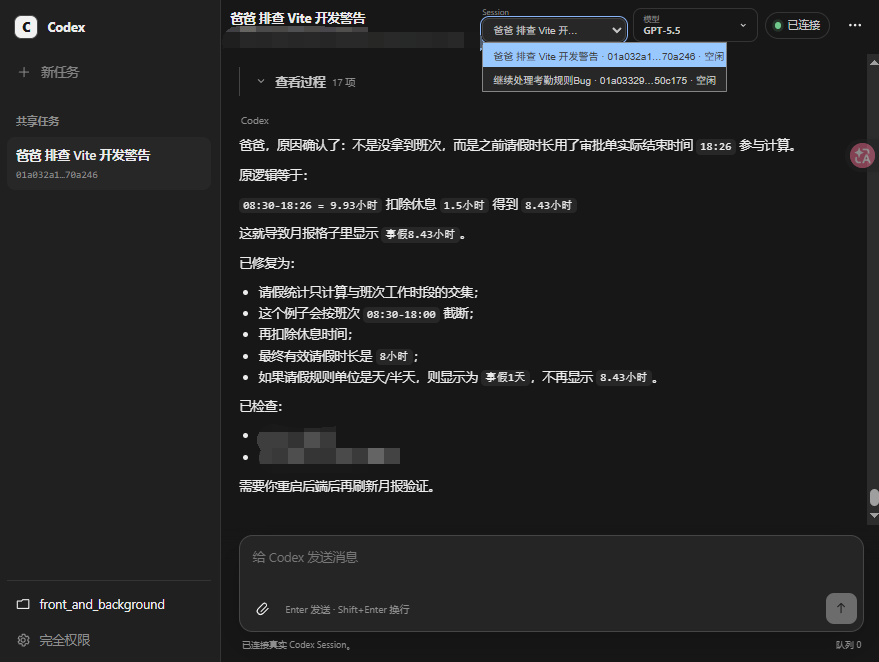

# 局域网共享 Codex 会话

在 Windows、macOS 或 Linux 本机共享 Codex Session，通过浏览器查看聊天历史和实时任务进度、发送文字与图片，并在配置权限内操作本地工作区。支持固定会话列表或按“项目 → Session”发现全部会话，也可通过同机 Cloudflare Tunnel 提供 HTTPS 公网入口。

同一个 Web 端口还可动态反代本机和局域网 HTTP 服务，无需为每个服务添加子域名或配置条目。

[下载版本包](https://github.com/hcr707305003/lan_codex_share/releases/latest) · [配置示例](lan_config.example.toml) · [v0.1.7 更新说明](docs/releases/v0.1.7.md)

**公网部署请设置项目密码，并且只代理可信服务。无密码不是只读：访问者可以发送 Codex 任务、读取授权文件并操作可达的内网服务。**

## 导航

- [原生版本包](#原生版本包) / [源码安装](#首次安装)
- [运行与配置](#运行)
- [Cloudflare Tunnel 公网访问](#cloudflare-tunnel-公网访问)
- [动态反代与跨端口接口](#动态反代本机及局域网服务)
- [故障排查](#故障排查) / [升级](#升级)

社区：[LINUX DO](https://linux.do/)

## 界面预览



网页端提供项目与 Session 导航、实时执行过程、流式回复、模型切换和消息输入，多个局域网访问者可以同步查看同一任务进度。

仓库维护者发布新版本时，请按 [流水线构建与版本发布](PIPELINE_RELEASE.md) 操作；每个 Release 必须详细说明与功能相关的新增、修复、行为变化和升级提示。

## 前置条件

- Python 3.11 或更高版本；Windows 通常使用 `python`，macOS/Linux 通常使用 `python3`。
- Codex CLI 已安装并登录，`codex --version` 可用。

从 GitHub Release 下载原生版本包时不需要安装 Python，但仍需安装并登录 Codex CLI。

## 原生版本包

Release 提供 Windows x64、Linux x64、Linux ARM64、macOS Intel 和 macOS Apple Silicon 五个平台的 ZIP。解压后将 `lan_config.example.toml` 复制为 `lan_config.toml`，然后直接运行：

```text
lan_codex_share --config=lan_config.toml
```

Windows 程序名为 `lan_codex_share.exe`。未指定 `--config` 时，程序只读取可执行文件同目录的 `lan_config.toml`；显式相对路径按当前终端目录解析。一个程序同时支持 Share 和本机 CLI：

```text
lan_codex_share
lan_codex_share cli --config=lan_config.toml
lan_codex_share cli --config=lan_config.toml --session <Session ID>
```

版本包未进行 Windows 代码签名或 macOS 公证，首次运行可能出现未知发布者提示。Release 同时提供 `SHA256SUMS.txt`，建议在运行前核对 ZIP 的 SHA-256。

## 首次安装

Windows PowerShell：

```powershell
git clone https://github.com/hcr707305003/lan_codex_share.git lan-codex-share
cd lan-codex-share
python -m venv .venv
.\.venv\Scripts\python.exe -m pip install -r requirements.txt
Copy-Item lan_config.example.toml lan_config.toml
```

macOS/Linux：

```sh
git clone https://github.com/hcr707305003/lan_codex_share.git lan-codex-share
cd lan-codex-share
python3 -m venv .venv
./.venv/bin/python -m pip install -r requirements.txt
cp lan_config.example.toml lan_config.toml
chmod +x start_lan_codex_share.sh open_lan_codex_cli.sh
```

编辑 `lan_config.toml`，至少确认工作区、共享会话、权限模式、端口和文件预览目录。

## 运行

Windows 可以双击 `start_lan_codex_share.cmd`；macOS/Linux 在终端运行：

```sh
./start_lan_codex_share.sh
```

启动窗口会显示类似 `http://192.168.1.20:8765/` 的分享地址和 Session 数量。全部 Session 模式会在网页左侧按“项目 → Session”导航；固定列表模式仍可通过网页顶部切换。选中的 ID 会写入地址栏，因此复制当前网址就能让同事直接打开同一会话。不同浏览器可以同时停留在不同 Session，互不抢占选择状态。其他设备无法连接时，请在当前系统防火墙中允许 Python/Codex 访问局域网；脚本不会自动修改防火墙。

全部 Session 模式可以在左侧直接释放已经加载且空闲的 Session，固定列表模式可以从当前任务菜单释放。释放会关闭桥接器对该 Session 的 Codex 写入连接，但不会删除聊天历史或文件；浏览器轮询不会自动重新占用，需要继续从网页操作时再点击“重新连接”。正在处理任务或仍有排队消息时不能释放。

源码环境也可以直接使用统一入口：

```sh
python -m lan_codex_share --config=lan_config.toml
python -m lan_codex_share cli --config=lan_config.toml --session <Session ID>
```

网页端采用 Codex 风格的任务界面，支持 Enter 发送、Shift+Enter 换行、拖拽图片和 Ctrl+V 粘贴图片。它直接投影真实 Session：回复、可读的思考摘要、命令输出、工具调用和文件修改都会实时流式显示；执行中自动展开过程，完成后默认折叠，可随时手动重开。隐藏的原始推理链不会对外展示。

长会话首屏只获取最近 **20 轮问答**，向上滚动接近顶部时自动再读取 20 轮，无需点击加载按钮，完整历史不会删除。加载中显示状态并防止重复请求，失败时提供“重试加载历史”。加载旧消息会保持阅读位置；流式更新复用未变化的消息节点，不重建整段历史。“查看过程”展开后才读取工具输出、思考摘要和 Diff，每页 20 项，可查看更早或最新过程；图片懒加载。点击“回到最近 20 轮”可释放已加载旧内容，持续跟随底部时页面也会限制自动累积的轮次。切换 Session 或刷新页面不影响后台任务。

此优化减少浏览器传输和渲染量，但共享服务首次恢复 Session 仍会读取完整记录，单条极长回复也仍有渲染成本。源码更新后需要重启共享程序并刷新浏览器；重新同步历史导致旧分页游标失效时，刷新页面后可重新翻页。

回复中的本地文件 Markdown 链接可以点击，并在会话右侧预览。Markdown 会格式化显示，常见源码和文本提供行号；`文件路径:行号:列号` 会自动定位并高亮。图片和 PDF 也可内嵌查看。只允许读取 `workspace` 和 `preview_roots` 显式授权的目录。

共享服务和本机 CLI 启动器都连接 `127.0.0.1:app_server_port` 上的同一个 App Server，因此可以同时查看和操作 Session，不会争抢会话文件锁。若该端口已经由兼容的 Codex App Server 占用，启动器会直接复用。Windows 可以双击 `open_lan_codex_cli.cmd`；macOS/Linux 运行 `./open_lan_codex_cli.sh`。多会话配置默认打开第一项，也可以指定 Session：

```sh
./open_lan_codex_cli.sh --session <Session ID>
```

Windows 终端对应使用 `open_lan_codex_cli.cmd --session <Session ID>`。不要另起一个不同的 App Server 同时写入同一 Session。

Windows Git Bash 可以直接运行 `.sh`，脚本会自动识别 `.venv/Scripts/python.exe`。WSL 属于独立的 Linux 环境，应在 WSL 内创建 `.venv`、安装依赖并登录 Codex CLI，不要直接复用 Windows 虚拟环境。

配置文件为 `lan_config.toml`：

```toml
workspace = "../workspace"
session_ids = [
  "01xxxxxxxxxxxxxxxxxxxxxxxxxxxxxx",
  "01yyyyyyyyyyyyyyyyyyyyyyyyyyyyyy",
]
permission_mode = "danger-full-access"
password = ""
public_origin = ""
host = "0.0.0.0"
port = 8765
app_server_port = 4500
preview_roots = [
  "../another-project",
]
```

相对路径以 `lan_config.toml` 所在目录为基准。`lan_config.toml` 是本机配置，已被 Git 忽略；仓库只提交不含个人路径的 `lan_config.example.toml`。

- `session_ids = []`：获取本机全部未归档主 Session，排除子代理任务，并按“项目 → Session”分组。Session 首次打开时才建立连接；新任务会自动出现在目录中，无需重启服务。
- `session_ids = ["Session A", "Session B"]`：固定共享这些会话。每个会话拥有独立历史投影、处理状态、模型设置和等待队列，并可同时执行任务；任一会话恢复失败时启动会直接报错，不会自动创建替代会话。
- 完全删除 `session_ids` 和 `session_id` 配置项：单会话自动模式。复用 `runtime/lan/state.json` 保存的会话；没有记录时自动创建。
- 旧版 `session_id = "..."` 仍可读取，便于升级，但不能与 `session_ids` 同时配置。
- `permission_mode = "read-only"`：只读访问。
- `permission_mode = "workspace-write"`：允许修改工作区。
- `permission_mode = "danger-full-access"`：完全访问本机文件系统。
- `password = ""`：不启用登录；设置非空字符串后，浏览器需要先输入该密码。登录状态只保留到浏览器关闭或桥接器重启，真实密码只应写入已忽略的 `lan_config.toml`。
- `public_origin = ""`：仅启用原有局域网访问；填写完整的 HTTPS 域名地址后，额外接受该公网入口。不支持通配符、路径、查询参数或多个域名。

网页目前没有交互式审批弹窗，因此审批策略固定为 `never`；实际访问范围由 `permission_mode` 限制。本机 CLI 会连接所选 Session，并采用相同权限模式。

模型选择器优先使用 App Server 返回的模型目录，同时为尚未列出 Astra 的旧版目录补充 `GPT-6 Astra`（请求 ID：`gpt-6-astra`）。兼容条目提供 low / medium / high / xhigh / max / ultra 思考强度和默认 / Fast 速度；服务端返回 Astra 时以服务端能力为准。条目可选不代表上游已开放权限，实际调用仍需账号及服务支持该模型。更新源码后重启共享服务即可加载新目录。

密码留空时，任何能访问地址的设备都可以读取共享聊天记录、发送任务、上传图片、取消当前任务，并在配置的权限范围内操作本机文件。配置非空密码可以阻止误入和普通未授权访问，但默认局域网 HTTP 仍可能被嗅探。`session_ids = []` 还会把发现到的所有 Session 项目目录加入文件预览授权范围。不要直接把 HTTP 端口映射到公网。

## Cloudflare Tunnel 公网访问

在本机配置中设置（域名和端口按实际替换）：

```toml
port = 9000
public_origin = "https://codex.example.com"
password = "请替换为你自己的长随机密码"
```

同一台电脑运行 `cloudflared`，在 Cloudflare Tunnel 中添加该域名的 Published application 路由，Service URL 填 `http://localhost:9000`，Path 留空。保留原始 Host，不要将 HTTP Host Header 覆写为 localhost；建议在 Cloudflare 开启 HTTP 到 HTTPS 重定向。若希望只用项目密码，可不创建 Cloudflare Access 应用（已经创建的则移除该域名对应的 Access 保护），Tunnel 本身仍保留。随后重启共享服务并刷新网页。

- 公网只接受 `public_origin` 指定的域名和端口，发送操作仍校验 HTTPS Origin 和 CSRF；现有局域网 HTTP 入口不变。
- 公网域名的回源连接必须来自本机回环地址；不接受其他局域网设备冒充代理，不信任 `X-Forwarded-Host`、`X-Forwarded-Proto`、`X-Forwarded-For` 或 `CF-Connecting-IP` 来放行请求。`cloudflared` 不应运行在另一台电脑或独立容器网络中。
- 设置密码后，会话、事件流、图片、文件预览和下载、任务操作均要求项目登录。HTTPS 登录 Cookie 使用 `Secure`、`HttpOnly`、`SameSite=Strict`；局域网 HTTP 登录单独保留兼容行为。
- 允许临时设置 `password = ""` 完全免登录，启动时会输出公网安全警告。**这不是匿名只读模式：所有访问者均可发送任务、读取授权文件，并按配置权限操作本机。** 强烈建议设置密码，并限制共享 Session 和权限。
- 登录失败限流按直接连接地址计算，同一个本机 Tunnel 的访问者共享限流额度：一分钟内五次失败后暂时禁止登录。忽略转发 IP 是为了防止伪造请求头绕过限流。
- 修改密码或公网地址需要重启共享服务，原登录 Cookie 随重启失效；域名和真实密码只放在已忽略的本机配置中。

程序不会自动安装、启动或管理 Tunnel。

## 动态反代本机及局域网服务

无需配置服务列表，也无需新增子域名。保持同一条 Tunnel 路由回源到共享程序的 Web 端口，在网址后加 `/proxy/目标:端口/` 即可。例如：

```text
https://codex.example.com/proxy/localhost:1122/
https://codex.example.com/proxy/localhost:13333/
https://codex.example.com/proxy/192.168.1.20:3301/
https://codex.example.com/proxy/192.168.1.20:3301/#/login
http://192.168.1.20:9000/proxy/localhost:1122/
```

`localhost` 指运行共享程序的电脑，不是访客电脑。末尾可以继续添加目标路径及查询参数，例如 `/proxy/localhost:1122/api/items?page=1`。原来的根路径和 `?session=...` 仍用于 Codex 会话。未带结尾 `/` 的服务根入口会自动补齐。

`#/login` 等片段保留给目标前端路由，不会发送到服务器；选择代理服务必须使用 `/proxy/目标:端口/` 路径，不能只在首页后面添加 `#端口`。例如前端运行在 3301、API 运行在 13333 时，打开前端的代理入口即可，常见 HTTP API 请求会按实际端口自动映射。

### 支持范围

- 目标使用 `localhost`、规范 IPv4 地址或 `[::1]`，必须显式填写端口；仅允许回环地址及 `10.0.0.0/8`、`172.16.0.0/12`、`192.168.0.0/16`。不解析任意域名，不代理公网、链路本地或云元数据地址。
- 禁止代理当前共享 Web 端口和配置的 Codex App Server 端口（默认 4500），该限制对所有目标 IP 生效。
- 回源协议是 HTTP；支持 GET、HEAD、POST、PUT、PATCH、DELETE、OPTIONS，以及 WebSocket 双向转发。不是任意 TCP 代理，不支持 CONNECT、数据库协议或 HTTPS-only 回源。
- 支持查询参数、普通表单、二进制和 multipart 上传、chunked 上传、文件下载及 SSE 流式响应。单次上传最多 128 MiB，超过 1 MiB 时临时写盘，结束后清理；HTTP 读写超时为 30 秒，WebSocket 单方向空闲超时为 30 分钟。Tunnel 自身的限制也仍然适用。
- 不启动、重启或修改目标服务；连接失败返回 502，非法地址返回 400/403。

### 登录与安全边界

项目密码统一保护反代入口。设置密码时，首次直接打开反代网址会提示先去共享首页登录，登录后刷新反代页即可。密码为空时完全免登录，**任何能访问入口的人都可以访问允许范围内的本机和内网 HTTP 服务，而不只是查看网页**；`permission_mode` 仅约束 Codex 任务，不约束目标服务自身的功能。目标服务原有登录保护仍保留。

反代写入和 WebSocket 请求要求本站 Origin，不能直接套用 Codex 的 JSON/CSRF 请求格式。转发时移除共享登录 Cookie、共享 CSRF Token 及访客伪造的代理头；目标的 `Set-Cookie` 路径限制到对应 `/proxy/目标:端口/` 下，不能覆盖共享登录 Cookie。

**同域名子路径并不是浏览器安全隔离。** 代理页的 JavaScript 与共享页面同源，必须只接入可信服务；Cookie 路径处理不等于沙箱，不能防止恶意同源脚本访问共享接口。不要把无密码动态代理长期公开到互联网。

### 子路径兼容性

程序会尽力处理常见 HTML/CSS 资源地址、重定向、服务 Cookie，以及浏览器的 fetch、XHR、WebSocket、EventSource 和 History API。根路径模块或资源请求若带有同源反代页 Referer，会重定向回该服务前缀，不依赖全局“当前服务”状态。

支持前后端跨端口自动转发。例如打开 `/proxy/127.0.0.1:3301/` 后，页面里的 `http://localhost:13333/api/users` 会自动经同域名的 `/proxy/localhost:13333/api/users` 请求共享电脑上的后端，无需再配置一个 Tunnel 或修改前端 API 地址。覆盖 fetch/Request、XHR（包括使用 XHR 的 Axios）、WebSocket、EventSource，以及支持改写的 HTML/CSS 资源地址和重定向。`localhost`、回环及 RFC1918 地址会按各自端口转发，已有 `/proxy/` 链接不会重复加前缀，公网地址保持不变。

浏览器侧的自动跨服务映射仅适用于 HTTP/WS 回源（未指定端口时为 80）；不会把写明 `https://` 或 `wss://` 的其他本地服务降级为 HTTP。下文针对 JSON 中当前后端资源地址的兼容处理是限定例外。协议相对的本地资源地址（例如 `//localhost:13333/image.png`）按 HTTP 回源处理。所有映射仍受项目密码、目标地址及禁止端口规则约束。

跨地址改写带正文的 `Request` 对象时，会先在浏览器内存中读取正文再发送，以兼容共享服务的 HTTP/1.1；这种调用方式不保留浏览器端流式上传。普通 fetch/XHR 上传仍沿用原调用方式，服务端上传大小限制不变。

不超过 2 MiB 的未压缩 JSON（`application/json` 或 `application/*+json`）支持一个限定的资源地址适配：如果完整 URL 字符串值指向当前响应后端的同一主机和端口，会转换为当前分享域名及该后端的反代路径。例如 HTTP 后端根据转发协议头生成 `https://内网IP:端口/二维码地址`，也能通过原 HTTP 反代加载。查询参数保留；不改对象键、普通文字、数字、公网域名或其他后端地址，不等于支持任意 HTTPS 回源。压缩、超限及部分响应不改写。

只有不超过 2 MiB 的未压缩 HTML/CSS/JSON 会缓冲适配；其他内容保持流式透传。不批量替换 JavaScript，JSON 只替换上述完整资源 URL，不重新序列化业务数字。严格 CSP、资源完整性校验、前端路由 base、Worker、JavaScript 直接设置 Cookie 或动态导航等场景可能仍需应用侧适配。不会取消目标应用的 CSP 或原有权限限制，也不保证所有 Web 应用零配置兼容。

## 故障排查

| 现象 | 检查方法 |
| --- | --- |
| 内网能打开，公网返回 Cloudflare 502 | 先确认共享程序仍在运行，再从 Tunnel 所在电脑访问 `http://127.0.0.1:Web端口/`。检查 Tunnel 回源端口及 HTTP 协议；仅凭 502 不能断定是应用、网络还是 Tunnel 出错。 |
| 页面返回 200，但仍然白屏 | 在浏览器 Network 中检查必需的 JS/CSS 是否失败。Vite 开发页面会产生大量模块请求；v0.1.6 增大连接等待队列以缓解突发连接重置，但不保证消除所有 502。 |
| 二维码或接口返回的图片加载失败 | 检查返回 URL 的主机、端口及协议。同一后端 JSON 资源 URL 可自动适配；其他 HTTPS 服务、压缩或超限 JSON 不在该处理范围。 |
| 代理页提示先登录或返回 401 | 先在共享首页输入项目密码，再刷新代理页；目标服务自己的登录可能仍然需要。 |
| 返回 400/403 | 核对 `public_origin`、Host、Origin、显式端口和目标地址范围；共享端口与 App Server 端口不能作为反代目标。不要通过伪造转发头绕过检查。 |
| 某项 WebSocket 功能失败 | 确认对应端口确实运行 WebSocket 服务。目标服务本身不可用时，反代不会将它启动。 |

停止程序时按一次 Ctrl+C，等待后台连接清理结束。连续中断可能打断现有清理流程并显示 `KeyboardInterrupt`；本版本没有修复重复 Ctrl+C 的退出体验。CMD 出现 `Terminate batch job (Y/N)?` 时输入 `Y`，不必反复按 Ctrl+C。

## 升级

1. 备份并保留本机 `lan_config.toml` 和 `runtime/`，不要用示例配置覆盖真实配置。
2. 停止旧共享程序，替换对应平台程序；源码用户更新代码并使用现有虚拟环境安装 `requirements.txt`。
3. 仅需内网访问时保留 `public_origin = ""`；需要公网时按上文配置域名、同机 Tunnel 和项目密码。
4. 重新启动共享程序并刷新浏览器。本版本包含服务端改动，仅刷新页面不能使全部修复生效。

升级不会自动安装或重启 Tunnel，也不需要本工具修改或重启被代理的业务服务。版本包不包含个人配置、聊天运行数据或日志；完整功能变更见 [版本发布记录](https://github.com/hcr707305003/lan_codex_share/releases)。
